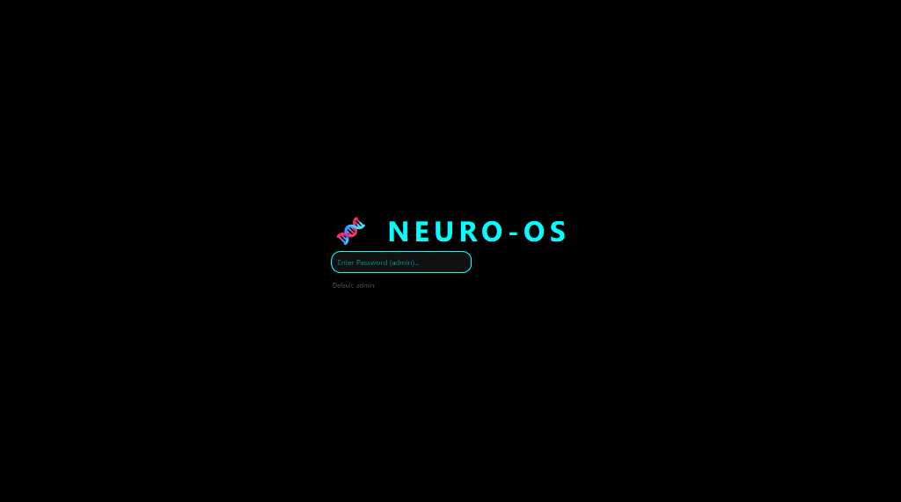
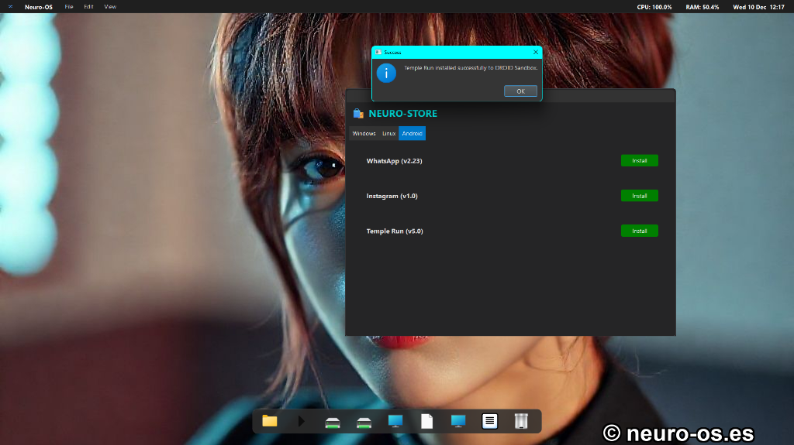
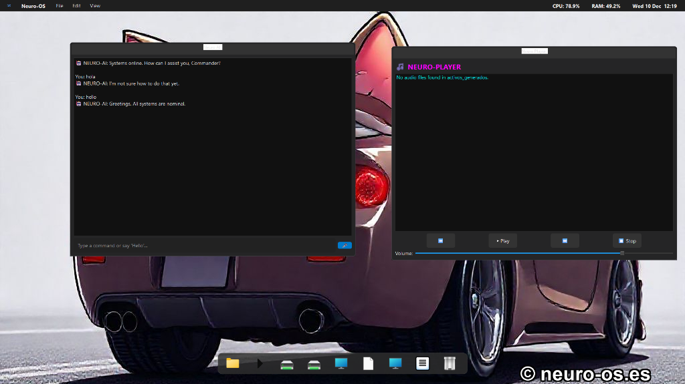

<div align="center">
  
</div>

# 🧠 Neuro-OS Desktop Environment (Español)
> **Entorno de escritorio multiplataforma – Motor gráfico + gestor de ventanas + ecosistema de aplicaciones**
>
> 🚧 **EN CONSTRUCCIÓN / UNDER CONSTRUCTION** 🚧
> *Este proyecto tiene bugs conocidos que se irán corrigiendo. No es una versión estable.*

[](https://www.python.org/)
[](https://doc.qt.io/qtforpython/)
[](LICENSE)
[](https://www.microsoft.com/windows)

---

| **Versión** | **Estado** | **Autor** |
|:---:|:---:|:---:|
| v3.0 | Release Candidate | José Manuel Moreno Cano |


## 📌 ¿Qué es Neuro-OS Desktop?

**Neuro-OS Desktop** es un entorno de escritorio completo escrito en Python (PySide6/Qt), diseñado para ejecutarse sobre Windows o Linux.

No es un sistema operativo independiente, sino una capa gráfica avanzada que simula la experiencia de un SO moderno con:

*   ✅ Interfaz estilo sistema operativo futurista
*   ✅ Dock, multitarea, ventanas MDI
*   ✅ Gestor de aplicaciones & Temas visuales
*   ✅ Motor de IA autónoma
*   ✅ Suite multimedia y gráfica
*   ✅ Sistema de seguridad multicapa

> *Este repositorio contiene solo el Desktop Environment completo, no el kernel ni la ISO experimental.*

---

## ⚠️ Importante: Qué NO es este proyecto

Para evitar confusiones:

### ❌ Neuro-OS NO es (todavía):
*   Un sistema operativo autónomo o independiente.
*   Un reemplazo de Windows, Linux o macOS.
*   Un kernel propio customizado a bajo nivel.
*   Un entorno con drivers, hardware o kernel personalizados.

### ✔️ Neuro-OS SÍ es:
*   **Un entorno de escritorio** que funciona sobre un sistema operativo existente.
*   **Un ecosistema modular** de aplicaciones.
*   **Una simulación de SO multiplataforma**.
*   **Un proyecto educativo y experimental** para expandir funcionalidades con IA.

---

## 🚀 Características principales

### 🖥️ Entorno de escritorio completo
*   **Pantalla de arranque:** Secuencia de boot simulada.
*   **Login seguro:** Autenticación real (PBKDF2 + Salt) con visuales biométricos.
*   **Escritorio:** Wallpaper dinámico (StarField Engine) y Dock personalizable.
*   **Ventanas MDI:** Controles completos (min/max/close) y tiling.



### 🧱 Seguridad integrada
*   **Neuro-ID v2:** Hashing avanzado con salt.
*   **Firewall activo & Anti-tamper:** Protección en tiempo real.
*   **TrustChain:** Firma digital de aplicaciones.
*   **EvoBridge:** Sistema de auto-reparación.

### 📦 Compatibilidad multiplataforma simulada
Neuro-OS Desktop incluye interfaces que permiten instalar software desde distintos ecosistemas.
*(IMPORTANTE: No redistribuye software propietario, actúa como launcher hacia tiendas oficiales).*



| Ecosistema | Gestor | Estado |
|:---|:---|:---:|
| **Windows** | Windows Store Launcher | ✅ Implementado |
| **Linux** | APT (WSL bridge) | ✅ Implementado |
| **Android** | ADB APK Installer | ✅ Implementado |
| **macOS** | App Store + Homebrew | ✅ Implementado |

### 🛠️ Herramientas del Sistema
*   **Update Manager & Drivers Installer**.
*   **Desfragmentador lógico & Gestor de caché**.
*   **Editor de registro & Texto**.


### 🎨 Suite gráfica & 🎧 Multimedia
*   **Gráficos:** Editor Paint 2D, CAD 2D, Visualizador 3D.
*   **Audio:** Reproductor musical, Grabadora, Panel de sonido.
*   **Apps:** Chat integrado, widgets flotantes.



### ⚡ Optimización por IA
*   **Game Booster:** Optimizador de recursos para juegos.
*   **Modos de Energía:** Performance, Balanced, Power Saver.
*   **Smart Suspend:** Suspensión automática de ventanas inactivas.

---

## 📁 Estructura del repositorio

```text
/Neuro-OS-Desktop
│
├── neuro_os_v3_complete.py         # Entorno de escritorio principal
├── neuro_resource_manager.py       # Optimización y gestión de memoria
├── neuro_package_managers.py       # 4 gestores de paquetes
├── neuro_app_installer.py          # Instalador/desinstalador universal
├── neuro_essential_apps.py         # Apps esenciales
├── neuro_system_tools.py           # Herramientas del sistema
├── neuro_display_misc_control.py   # Configuración de pantalla y miscelánea
├── neuro_graphics_suite.py         # Paint + CAD + 3D Viewer
├── neuro_game_booster.py           # Optimizador de juegos con IA
├── about_neuro_os.py               # Panel About
│
└── SYSTEM_DATA/                    # Configuración, usuarios, iconos, cache
```

---

## ▶️ Ejecución

### Requisitos
*   **Python 3.11** o superior.
*   **PySide6** (Qt) + `pip` + `venv` recomendados.
*   Funciona en **Windows** o **Linux**.

### Instalación
```bash
pip install -r requirements.txt
```

### Ejecución
```bash
python neuro_os_v3_complete.py
```

---

## 🤖 Sobre el desarrollo

Este proyecto fue construido:
1.  En **2 días intensivos**.
2.  Con módulos previos del autor.
3.  Con **apoyo de IA** para acelerar arquitectura y código.
4.  Como **demostración técnica** y plataforma experimental.

> *No pretende competir con sistemas operativos reales, sino explorar conceptos de UX, IA, modularidad y ecosistemas cruzados.*

---

## ⭐ Estado del proyecto

### Actual
*   ✅ **100% funcional** como Desktop Environment.
*   ✅ Estable para pruebas, demos y entusiastas.
*   ✅ Compatible con Windows y Linux.

### Futuro
*   🚀 Kernel propio (**Neuro-Kernel v1.0**).
*   🚀 ISO completa booteable.
*   🚀 Versión Mobile & Integración VR/AR.
*   🚀 Marketplace oficial de apps.

---

## ®️ Propiedad Intelectual

> **AVISO LEGAL:** La marca **Neuro-OS™**, el logotipo, y la arquitectura de software "Neuro-Genesis" se encuentran actualmente en **proceso de registro y patente** ante los organismos de Propiedad Intelectual competentes.
>
> El uso no autorizado de la marca o la redistribución comercial del código fuente sin consentimiento explícito está prohibido durante este periodo de tramitación.

---

## 🤝 Contribuciones & Contacto

**Pull requests bienvenidos.** Se aceptan módulos nuevos, apps, mejoras de seguridad y traducciones.

*   **Autor:** José Manuel Moreno Cano
*   **Email:** neuro.so.ia.sim@gmail.com

---

<br>
<br>

<div align="center">
  
</div>

# 🧠 Neuro-OS Desktop Environment (English)
> **Cross-platform Desktop Environment – Graphics Engine + Window Manager + App Ecosystem**
>
> 🚧 **UNDER CONSTRUCTION** 🚧
> *This project has known bugs that will be fixed progressively. Do not consider it stable yet.*

[](https://www.python.org/)
[](https://doc.qt.io/qtforpython/)
[](LICENSE)
[](https://www.microsoft.com/windows)

---

| **Version** | **Status** | **Author** |
|:---:|:---:|:---:|
| v3.0 | Release Candidate | José Manuel Moreno Cano |

## 📌 What is Neuro-OS Desktop?

**Neuro-OS Desktop** is a complete desktop environment written in Python (PySide6/Qt), designed to run on top of Windows or Linux.

It is not a standalone operating system, but an advanced graphical layer that simulates the experience of a modern OS featuring:

*   ✅ Futuristic OS-style Interface
*   ✅ Dock, Multitasking, MDI Windows
*   ✅ App Manager & Visual Themes
*   ✅ Autonomous AI Engine
*   ✅ Multimedia & Graphics Suite
*   ✅ Multi-layer Security System

> *This repository contains only the complete Desktop Environment, not the kernel nor the experimental ISO.*

---

## ⚠️ Important: What this project is NOT

To avoid confusion:

### ❌ Neuro-OS is NOT (yet):
*   A standalone or independent operating system.
*   A replacement for Windows, Linux, or macOS.
*   A custom low-level kernel.
*   An environment with custom drivers or hardware abstraction layers.

### ✔️ Neuro-OS IS:
*   **A desktop environment** running on an existing OS.
*   **A modular ecosystem** of applications.
*   **A cross-platform OS simulation**.
*   **An educational and experimental project** to expand capabilities with AI.

---

## 🚀 Key Features

### 🖥️ Full Desktop Environment
*   **Boot Screen:** Simulated boot sequence.
*   **Secure Login:** Real authentication (PBKDF2 + Salt) with biometric visuals.
*   **Desktop:** Dynamic wallpaper (StarField Engine) and customizable Dock.
*   **MDI Windows:** Full controls (min/max/close) and tiling.

### 🧱 Integrated Security
*   **Neuro-ID v2:** Advanced hashing with salt.
*   **Active Firewall & Anti-tamper:** Real-time protection.
*   **TrustChain:** Digital app signing.
*   **EvoBridge:** Self-healing system.

### 📦 Simulated Cross-Platform Compatibility
Neuro-OS Desktop includes interfaces allowing software installation from different ecosystems.
*(IMPORTANT: Does not redistribute proprietary software, acts as a launcher to official stores).*

| Ecosystem | Manager | Status |
|:---|:---|:---:|
| **Windows** | Windows Store Launcher | ✅ Implemented |
| **Linux** | APT (WSL bridge) | ✅ Implemented |
| **Android** | ADB APK Installer | ✅ Implemented |
| **macOS** | App Store + Homebrew | ✅ Implemented |

### 🛠️ System Tools
*   **Update Manager & Drivers Installer**.
*   **Logical Defragmenter & Cache Manager**.
*   **Registry & Text Editor**.

### 🎨 Graphics Suite & 🎧 Multimedia
*   **Graphics:** 2D Paint Editor, 2D CAD, 3D Viewer.
*   **Audio:** Music Player, Recorder, Sound Panel.
*   **Apps:** Integrated Chat, floating widgets.

### ⚡ AI Optimization
*   **Game Booster:** Resource optimizer for gaming.
*   **Power Modes:** Performance, Balanced, Power Saver.
*   **Smart Suspend:** Automatic suspension of inactive windows.

---

## ▶️ Execution

### Requirements
*   **Python 3.11** or higher.
*   **PySide6** (Qt) + `pip` + `venv` recommended.
*   Runs on **Windows** or **Linux**.

### Installation
```bash
pip install -r requirements.txt
```

### Execution
```bash
python neuro_os_v3_complete.py
```

---

## 🤖 About Development

This project was built:
1.  In **2 intensive days**.
2.  With previous modules by the author.
3.  With **AI support** to accelerate architecture and code.
4.  As a **technical demo** and experimental platform.

> *It does not intend to compete with real operating systems, but to explore UX, AI, modularity, and cross-ecosystem concepts.*

---

## ⭐ Project Status

### Current
*   ✅ **100% Functional** as a Desktop Environment.
*   ✅ Stable for testing, demos, and enthusiasts.
*   ✅ Compatible with Windows and Linux.

### Future
*   🚀 Custom Kernel (**Neuro-Kernel v1.0**).
*   🚀 Full Bootable ISO.
*   🚀 Mobile Version & VR/AR Integration.
*   🚀 Official App Marketplace.

---

## 🤝 Contributions & Contact

**Pull requests welcome.** New modules, apps, security improvements, and translations are accepted.

*   **Author:** José Manuel Moreno Cano
*   **Email:** neuro.so.ia.sim@gmail.com

---

## ®️ Intellectual Property

> **LEGAL NOTICE:** The **Neuro-OS™** trademark, logo, and "Neuro-Genesis" software architecture are currently in the **process of registration and patenting** with the relevant Intellectual Property offices.
>
> Unauthorized use of the brand or commercial redistribution of the source code without explicit consent is prohibited during this processing period.

---

<div align="center">
  <h3>🧠 Neuro-OS Desktop</h3>
  <p><em>“Limitless Compatibility. Uncompromised Security.”</em></p>
</div>
